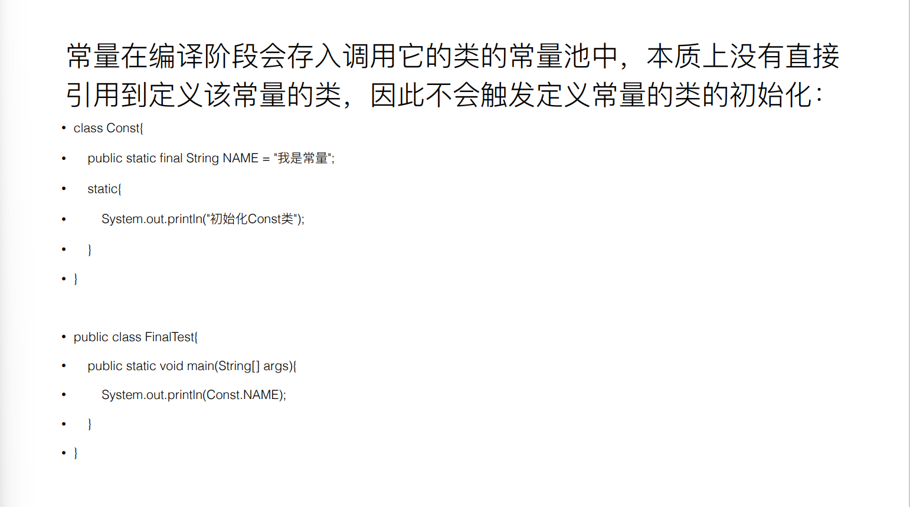
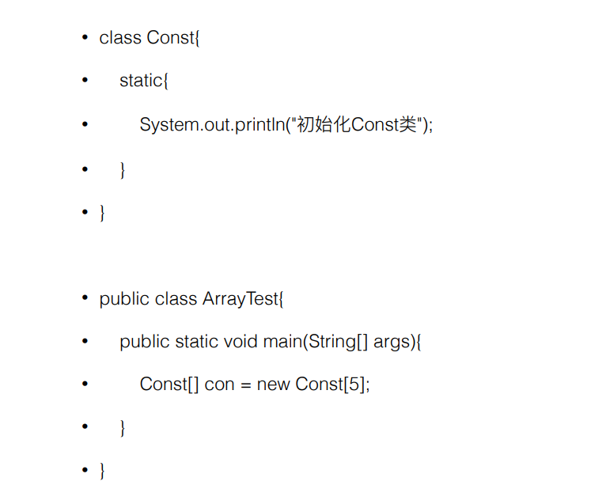
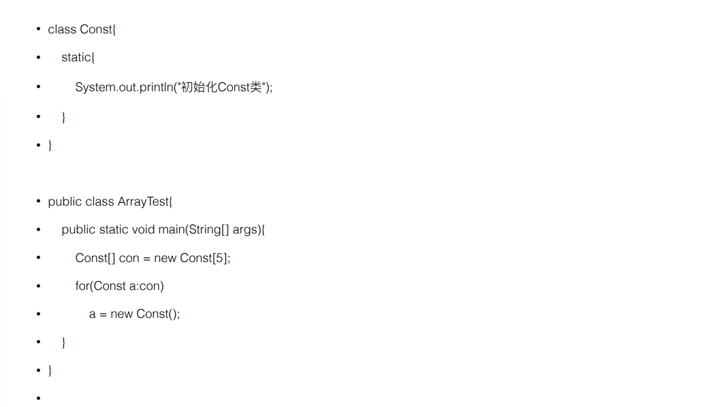

# 软工一复习

**by flamingo   /on 2023.6.21**

## 一、邵栋老师模块

### 1、软件开发过程

- 简称软件过程，由一组相互关联的活动组成，这些活动将一个或多个输入转化为输出，同时消耗资源来完成转换。

- **软件开发过程是指⼀个软件产品开发的⽅法，它描述 了软件开发中的活动和任务。**

- “过程决定质量”

- 常⻅的软件开发过程模型有瀑布（线性）、迭代、和敏捷 软件开发等，有很多分类的⽅法。

- 软件过程对软件开发具有重要的指导意义，软件开发不应该是⽆序的、混乱的。

  原因是：软件项⽬通常都是很复杂的系统，开发⼈员需要按照⼀ 定的开发模型来分解⼯作任务，按照⼀定的步骤进⾏⼯ 作以完成项⽬的开发。如果没有开发模型的存在，开发⼈员很容易迷失在复杂系统中，缺乏指引，陷⼊混乱。

### 2、软件开发

- 软件开发是⼈类的⼀项⾼复杂度的**集体**智 ⼒活动，其现实问题的复杂度反映到开发 中主要表现为**架构、技术、过程和组织四 个维度上的复杂度**，它们往往紧密地交织 纠缠在⼀起并相互转化。
- 软件⼯程发展趋势是：**架构逐渐去中心化、技术趋于自动化、过程趋于增量和迭**
  **代，以及组织趋于自治**

### 3、软件开发生命周期（SDLC）

指软件产品从**开发到报废**的生命周期，通常周期中包括了需求分析、软件设计、实现与调试、测试与验收、部署、维护等活动。**【问题定义，需求分析，软件设计，程序编码，软件测试，运行维护】**

### 4、软件开发模式

- #### 创建-修补

  - 分成编码和修补两个阶段，没有长期开发计划，仅能满足当前需要，一般不会给出设计原因。

  - **优点：**适用于规模小、质量要求低的。

  - **缺点：**当添加新功能时，会因为大量的临时的局部设计而难以实现，同时，系统缺陷很多，难以修补。

- #### 瀑布模型

  - 瀑布模型核⼼思想是根据开发活动来分解项⽬。

  - 如果在某个阶段出现了问题，那么最好“返回”上⼀个阶段并进⾏修改。项⽬开发过程像是从⼀个阶梯“流动”到下⼀个阶梯，这也是瀑布模型名称的由来。

  - 按时间顺序描述了一个软件项目的开发

  - 瀑布模型将软件**⽣命周期**划分为制定计划、需求 分析、软件设计、程序编写、软件测试和运⾏维护等**六个基本活动**。

  - **优点：**为项目提供了按阶段划分的检查点；当前一阶段完成后，只需要去关注后续阶段。

  - **缺点：**①通过回到前⾯的阶段或修改前⾯某个阶段的结果是非常常见的现象，而这时带来的成本增加和系统开发的混乱是很难避免的。②在项目各个阶段之间极少有反馈，开发人员很难判断其前期的工作是否正确。③**只有在项目生命周期的后期才能看到结果**。增加需求误解的可能性。

- #### 迭代式软件开发

  - 根据软件项目的不同功能子集来分解项目。在迭代式开发方法中，整个开发工作被组织为一系列的短小的项目，被称为一系列的迭代。每个迭代包含了需求、设计、实施（编码）、部署、测试等各种类型的开发活动，迭代完成之后需要对迭代完成的结果进行评估，并以此为依据来制定下一次迭代的目标。**每个迭代周期结束时都应该得到一个经过测试的、集成起来的基本可用的软件产品。**

  - **优点：**①易于应对需求变更，可以很方便地在每一个迭代结束时修改原有需求；②提高团队士气，开发人员的士气和对项目的热情决定了软件项目的成败。每次迭代都能看到自己的成果，有利于增强信心。

  - **缺点：**需求或设计中的错误往往只有到了项目后期才能够被发现；对于项目风险的控制能力较弱；软件项目常常延期完成或开发费用超出预算；项目管理人员专注于文档的完成和审核来估计项目的进展情况。

    `测试与集成都是非常难于估算的开发活动，不能把这样的活动放到迭代开发的最后进行，否则就无法得到迭代式开发的益处。而应该在每一次迭代都进行`

## 二、编程基础Ⅰ-分解与抽象

### 1、降低复杂度

1. 分解（组合）：分解后各部分复杂度要变小，各部分**关联小，相对独立**。
2. 抽象：把具体的实现**抽象成方法和接口**，接口的复杂度要比具体的实现小。只要调用接口或方法，就能实现具体的功能，二无需书写复杂的实现过程。抽象类本身没用，除非被继承，有了子类，子类可以被实例化。

### 2、程序=算法+数据结构

1. 算法是计划、过程、步骤（该如何去些写）。
2. 数据结构是操作的目标和对象（算法处理的内容）。
3. 两者相互配合才能有良好的程序。

### 3、算法建模

1. 每种语言都会提供的三种机制：

   - 基本表达式：最基本的数字运算和逻辑运算。
   - 分解（组合）的方法
   - 抽象的方法

2. 两种思路：

   - 迭代：也即循环，可以正向循环，也可以反向循环

   - 递归：也即重复调用函数，递归是重复调用直到初始状态然后再逐层返回，因此要特别注意不能忘了最初始的定义，如0！=1

     

### 4、数据建模

- 
-


1. 基础数据类型：整数，浮点数，布尔值

2. 数据的组合：

   - 数组：同一类数据的组合
   - 结构体struct：不同数据的组合
   - 对象：数据和行为的组合

3. 用日志记录数据（python）：

   


## 三、编程基础Ⅱ-可计算性

### 1、停机问题

不存在这样⼀个程序（算法），它能够计算任何程序（算法）在 给定 输⼊上是否会结束（停机）。

### 2、可计算函数不一定实际可计算（在无限的时间的储存空间的条件下可计算）

### 3、可计算模型

目标是建立一整套形式化的可计算模型

1. μ-递归函数
2. 图灵机
3. lambda演算
4. 寄存器

## 四、lambda演算

现代数字计算机可以计算的本质上都是递归函数（图灵可计算函数）；非递归函数则是计算机不可计算的。

### 1、lambda项

1. 所有的变量都是 𝜆 项（名为原子）
2. 若 𝑀 和 𝑁 是 𝜆 项，那么 (𝑀 𝑁 ) 也是 𝜆 项（名为应用）
3. 若 𝑀 是 𝜆 项而 𝜙 是一个变量，那么 (𝜆𝜙.𝑀) 也是 𝜆项（名为抽象）

### 2、α变换

设 𝜆𝜙.𝑀 出现在一个 𝜆 项 𝑃 中，且设 𝜓 ∉ FV(𝑀)，那么把 𝜆𝜙.𝑀 替换成𝜆𝜓.[𝜓/𝜙] 𝑀
的操作被称为 𝑃 的 𝛼 变换。**（即把其中的自由变量替换成不属于M的其他符号）**

### 3、β规约

形如**(𝜆𝜙.𝑀) 𝑁**的 𝜆 项被称为 𝛽 可约式，对应的项[𝑁/𝜙] 𝑀则称为 𝛽 缩减项。**（也就是把N作为Φ代入到M中去）**

### 4、括号的省略规则

1. 最外层的括号可以省略，(\x.x)可以写成\x.

2. 左结合的**应用型的lambda项**，如(((MN)P)Q)，括号可以省略，表示为M N P Q（这个规则十分重要）

3. **抽象型的lambda项**，(𝜆𝜙.𝑀)的M里最外层的括号可以省略，如\x.(xy)可以写成\x.xy

4. *一个函数抽象的函数体将尽最大可能向右扩展*，即：`λx.M N`代表的是一个函数抽象`λx.(M N)`而非函数应用`(λx.M) N`。

   省略规则的具体应用（**关键是找\x.的抽象，\x.后面必然有相关的表达式和其一起作为一个抽象**）：

   - SUCC ZERO

     \n.\f.\x.f (n f x) \f.\x.x

     不妨先看到最右边的，x旁边有个\x.这两者为一个抽象，应该加括号，再左边是\f.，(\x.x)本身是个λ项，所以和\f.构成了一个抽象，故(\f.(\x.x))

     再看到左边的式子，f (n f x)均不为抽象，而是满足第3种情况，在在抽象种的M的括号可以省略，因此(f (n f x))要括起来，旁边还有\x.,\f.和\n.因此都要逐一括起来，(\n.(\f.\x.(f (n f x))))。所以（((\n.(\f.\x.(f (n f x)))))(\f.(\x.x))）

### 5、具体例子

lambda演算中常用的λ项：（为了简便，一般用\来代替λ）

- 𝐙𝐄𝐑𝐎 = 𝜆𝑓.𝜆𝑥.𝑥
- 𝐒𝐔𝐂𝐂 = 𝜆𝑛.𝜆𝑓.𝜆𝑥.𝑓 (𝑛 𝑓 𝑥)
- **TRUE:⇔ λ xy.x
  FALSE :⇔ λ xy.y**
- 𝐏𝐋𝐔𝐒 = 𝜆𝑚.𝜆𝑛.𝑚 𝐒𝐔𝐂𝐂 𝑛
- 𝐌𝐔𝐋𝐓 = 𝜆𝑚.𝜆𝑛.𝜆𝑓.𝑚 (𝑛 𝑓)
- 𝐏𝐎𝐖 = 𝜆𝑏.𝜆𝑒.𝑒 𝑏
- 𝐏𝐑𝐄𝐃 = 𝜆𝑛.𝜆𝑓.𝜆𝑥.𝑛 (𝜆𝑔.𝜆𝑒.𝑒 (𝑔 𝑓)) (𝜆𝑢.𝑥) (𝜆𝑢.𝑢)
- 𝐒𝐔𝐁 = 𝜆𝑚.𝜆𝑛.𝑛 𝐏𝐑𝐄𝐃 𝑚

## 五、编程基础Ⅳ-函数式编程范式

### 1、消除重复

- 抽象
- 数据过滤

### 2、高阶函数

**即把函数作为参数传入函数中，所谓函数的函数。**如在compare函数中，可以传入比较自己定义的比较函数，达到自己想要的比较目的。这就是高阶函数的一个例子


### 3、函数式编程范式（如Haskell语言）

**编程范式的主要作用在于提供且同时决定了程序员对于程序执行的看法**。

例如，在⾯向对象编程中，程序员认为程序是⼀系列相互作用的对象，而在函数式编程中⼀个程序会被看作是⼀个无状态的函数计算的序列。将计算机运算看作是数学中函数的计算，并且避免了状态以及变量的概念。

------

**A. Functions As First-class Citizens**

​ 函数被当作头等公民，意味着函数可以作为别的函数的参数、函数的返回值，赋值给变量或存储在数据结构 中，通常以高阶函数（ Higher Order Functions ）的形式存在。
**B. No Side Effects**
​ 在计算机科学中，函数副作用（ Side Effect ）指当调用函数时，除了返回函数值之外，还对外部作用域产生附加的影响，例如修改全局变量（函数外的变量）或修改参数。而严格的函数式编程是要求函数必须没有副作用，这意味着影响函数返回值的唯⼀因素就是它的参数。

由于没有副作用，所以程序支持并发执行，而不用采取锁机制，完全无需担心死锁的情况出现，但在结构化编程中是不能做到的，因为每一个函数都可能修改其外部状态，也就是产生副作用，而接下来运行的函数很可能依赖于这些被修改状态的值。

**因此，函数式编程非常适合那些需要高度并行的应用程序。**

**C. No Changing-state**
 在函数式编程中，函数就是基础元素，可以完成几乎所有的操作，哪怕是最简单的计算，也是用函数来完成 的，而我们平时在其他类型中所理解的变量（ 可修改，往往⽤来保存状态 ）在函数式编程中，是不可修改 的，这意味着状态（ State ）不能保存在变量中，而事实上函数式编程是使⽤函数参数来保存状态，最好的例子便是递归。

------

### 4、信号流

枚举器—>过滤器—>映射—>累积器

如python中的iterator,filter,map,reduce

### 5、编译器的结构

- 编译 Compile：把整个程序源代码翻译成另外⼀种代码，然后等待被执⾏，发⽣在运⾏之前，产物是 「另⼀份代码」。如编译成字节码
- 解释 Interpret：把程序源代码⼀⾏⼀⾏的读懂然后执⾏，发⽣在运⾏时，产物是「运⾏结果」。

结构：词法分析 • 语法分析 • 语义分析 • 中间代码⽣成 • 代码优化 • ⽬标代码⽣成

### 6、编程的算法考量

- 方法⼀：算法驱动：只在需要f(x)的值的时候，通过计算得到。
- 方法⼆：数据驱动：先通过计算，保存所有x对应的f(X)值，需要计算的时候直接访问。

## 六、结构化编程Ⅰ-思想

### 1、结构化方法

1. 思想
   - 自顶向下逐步求精
   - 算法+数据结构
2. 模型
   - 数据流图
   - 结构图
   - 流程图

### 2、数据流图

- 将系统看做是过程的集合；
- 过程就是对数据的处理；

#### 基本符号（一定要标准！！！第一第二种均可）


1. 外部实体：数据的生产者或者消费者
2. 过程：数据的处理转换
3. 数据流：通过过程是数据流从输入转换为输出
4. 数据存储：数据有时会被存储起来为以后使用

#### 语法规则

1. 过程是对数据的处理，必须有输⼊，也必须有输出，输⼊数据集应该和输出数据集**存在差异**
2. 数据流是必须和过程（**必须有过程参与**）产⽣关联的，它要么是过程的数据输⼊，要么是过程的数据输出

#### 理解

- 过程不一定是程序，可以是任何的能够处理的模块，甚至是人工处理
- 数据存储不一定是一个文件，可能是文件的一部分，或者是数据库元素等等，它代表静态的数据
- 数据流代表动态的数据

#### 案例一——订货系统


#### 案例二——课程表


### 3、结构图（均使用方框和短线，短线上标注数据的流动）

主要结构为最上层的**控制中心**，两边的**处理所有的输入和所有的输出和中间的处理过程**（3个里面需要具体再细分）：


#### 案例一——订货系统


#### 案例二——课程表


### 4、流程图


### 5、结构化编程总结

**根据行为来分解过程，接着设计数据来配合行为过程**

## 七、结构化编程Ⅱ-变量

### 1、变量的概念

- 物理的角度：计算机的数据存储单元

- 逻辑的角度：软件模型中的抽象数据单元
- 语义的角度：类的属性、方法的状态（每一个变量的不同的值都表示方法的不同状态）
- 优点：通过赋值语句，打破了引用透明性，能够以一种更模块化的方式构造系统（即同一个东西可以相互替换，如a=a+1，其中两个a的值不同）

**（函数的返回值只依赖于其输入值，这种特性就称为引用透明性，如数学中sinx中，sinx的值只取决于x，没有副作用，而在程序中，函数的执行不仅依赖于输入值，而且会受到全局变量，输入文件，类的成员变量等诸多因素的影响）**

- 缺陷：在命令式编程中，一个变量的值是不定的，所以**赋值的顺序**很重要，顺序的改变，会导致不同的结果。而函数式编程中，每个符号都是一个确定的值，所以顺序其实关系不大，对于每一个值都有相应的符号/变量

### 2、变量的属性

- **引用类型在堆里，基本类型在栈里。**

- 相比于float，double更为精确，因此，a*（b/a）！=b的情况更少出现，同时两者的误差页更小

- 均采用第一个单词首字母小写，其后大写的方式，常量应该全部大写，单词间用下划线分隔

- 因此变量的生存期开始于将变量绑定到⼀个特定存储单元的时刻，而结束于该变量从这个存储单元上解除绑定之时。

  根据生存期将它们分成四种类型，分别被称为**静态变量、栈动态变量、显性堆动态变量和隐性堆动态变量。**

- 如果⼀个变量声明于⼀个子程序单元或程序块之内，那么它就是这个子程序单元或程序块内的**局部变量**。程序单元或程序块的**非局部变量**是**指不在这个程序单元或程序块中声明、但又对其可见的变量。**

### 3、变量的行为

- 构成声明语句
- 和操作符构成表达式
- 初始化

### 4、常用变量用法

- 局部变量
- 属性字段（作为flag或者state等）

## 八，结构化编程Ⅲ-方法

### 1、方法的概念

1. 概念：
   - 物理角度：指令块
   - 逻辑角度：抽象指令单元
   - 语义的角度：行为
   - 分类：静态方法（类方法），成员方法
2. 方法的属性：
   - 名字
   - 所有者
   - 接口：方法名，返回值，参数（个数，顺序，类型），**抛出的异常**
   - 实现
   - 运行期
   - 可见性

### 2、方法的实现

1. 方法的声明

2. 方法的调用：

   - **同步**：主函数等待调用方法执行完毕再继续执行，用实心箭头表示；**异步**：主函数不等待调用的方法，用鱼骨箭头表示

   - A method uses **parameters**. A caller passes **arguments**.

     **parameter=形参(formal parameter)即方法声明中的参数，argument=实参(actual parameter)即调用者传入到方法中的参数**

3. 方法的结构

### 3、方法的常见用法

方法重载**overloading**

（在一个类中，不同的方法恰好名字相同）

重载的方法必须改变参数类型：**个数不同、类型不同、个数和类型相同但顺序不同**（但要注意，两个相同类型的交换顺序是无效的，如int a，int b）

## 面向对象编程Ⅰ-思想

### 面向对象思想

以前是函数之间的调用，现在是有职责的对象之间的交互

- 行为视角——结构化方法
- 数据视角——数据为中心方法
- 职责视角——面向对象方法

1. 职责：

   数据职责和行为职责

   所谓职责，我们可以理解它为功能，每个类应当只有单一职责

2. 协作

### 创建类的原因

- 对现实世界中的对象建模
- 对抽象对象建模
- 降低复杂度
- 隔离复杂度
- 隐藏实现细节
- 限制变化所影响的范围
- 创建中心控制点

## 面向对象编程Ⅲ-继承和多态

### 继承

定义：⼦类继承了父类所有的成员变量和方法

- 子类继承了父类所有的成员变量和成员方法但不包括私有变量
- 可以增加成员变量和成员方法
- 可以覆盖父类的成员方法
- 不可以覆盖父类的成员变量

### 多态

定义：多态是同一个行为具有多个不同表现形式或形态的能力。多态就是同一个接口，使用不同的实例而执行不同操作。

关键：编译时，编译器决定你是否能调⽤某个⽅法，依据引⽤变量的类型，⽽不是引⽤变量指向的对象的类型；执⾏时，JVM虚拟机决定实际哪个⽅法被调⽤，依据实际引⽤变量指向的对象的类型。

条件：继承、重写、基类引用指向派生类对象

局限：**不能使用派生类特有的成员属性和派生类特有的成员方法。**

⾮抽象类中不可以有抽象⽅法，抽象类中可以有⾮抽象⽅法

方法重写**overriding**（Java中无效，因其父类的私有方法自动是final的，对派生类隐藏）

- 条件：在不同类（⽗类和⼦类）、同⼀个个⽅法、⽅法名字相同
- 参数必须⼀致，返回值必须兼容。例如：⽗类返回Animal，⼦类返回dog
- ⽅法的可达性不能降低。例如：⽗类是缺省的，⼦类是public

## UML类图

### **可见性：**

- +：表示public
- -：表示private
- #：表示protected

### **属性**的完整表示方式是这样的：（[]内为可选）

**可见性  名称 ：类型 [ = 缺省值]**

### **方法**的完整表示方式如下

**可见性  名称(参数列表) [ ： 返回类型]**


### **类与类的关系**

1. 依赖：用虚线箭头
2. 关联：
   - 单项关联：用实线箭头
   - 双向关联：不带箭头的实线
   - 自关联：实线箭头指向自己
3. 聚合：带空心菱形的实线箭头
4. 组合：带实心菱形的实线箭头
5. 继承：带三角空心箭头的实线
6. 实现：带空心三角箭头的虚线

## UML用例图

## GUI

### GUI的三个关键要素

- 组件
- 布局
- 事件

读写均要有try catch，会存在IOException的异常

别忘了frame的尺寸和可见性

别忘了textArea的三个属性设置

```java
textArea.setLineWrap(true);
textArea.setWrapStyleWord(true);
textArea.setEditable(false);
```

## 九、类的初始化

1.当访问⼀个Java类或接⼝的静态域时，只有真正声明这个域的类或接⼝才会被初始化

// 输出结果为：类A初始化\n100\n

2.编译时常量不会引起初始化，编译时不是常量会引起初始化（static块被执行）

//输出结果为：3\nInitializing\n5n\10\n

3.见下图

//输出结果：我是常量\n

4.通过数组定义来引⽤类，不会触发类的初始化

//无输出，但这段代码⾥触发了另⼀个名为“LLConst”的类的初始化，它是⼀个由虚拟机⾃动⽣成的、直接继承于java.lang.Object 的⼦类，创建动作由字节码指令 newarray 触发，这是⼀个对数组引⽤类型的初始化，⽽该数组中的元素仅仅包含⼀个对 Const 类的引⽤，并没有对其进⾏初始化

这里的第二个new出发了Const类，进行了初始化。
//输出结果：初始化Const类\n

//接口初始化：⼀个接⼝在初始化时，并不要求其⽗接⼝全部都完成了初始化，只有在真正使⽤到⽗接⼝的时候（如引⽤接⼝中定义的常量），才会初始化该⽗接⼝。

## 十、JVM与字节码基础

### Class文件结构

- 一组以8位字节为基础单位的⼆进制流
- 魔数 0xCAFEBABE
- 版本号
- 常量池：字⾯量、符号引⽤
- 访问标志
- 类索引、⽗类索引与接⼝索引集合
- 字段表集合
- ⽅法表集合
- 属性表集合（代码的实现作为⼀个属性值）
